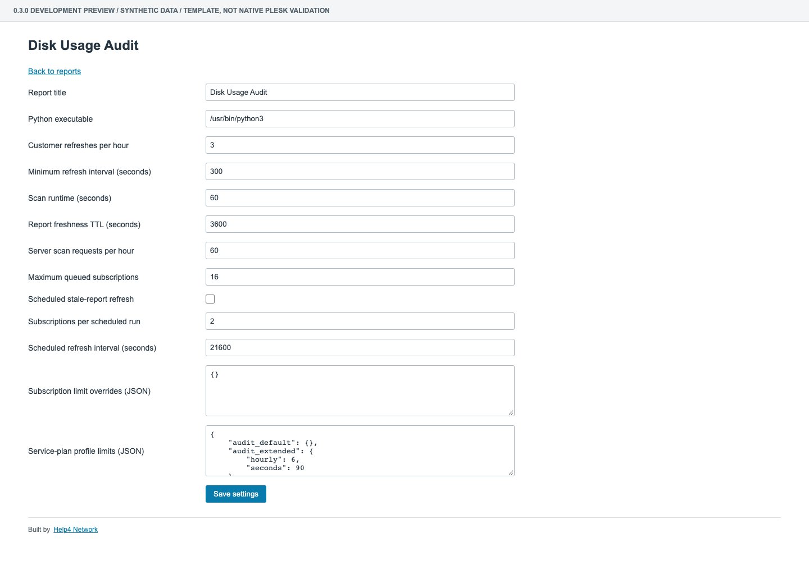
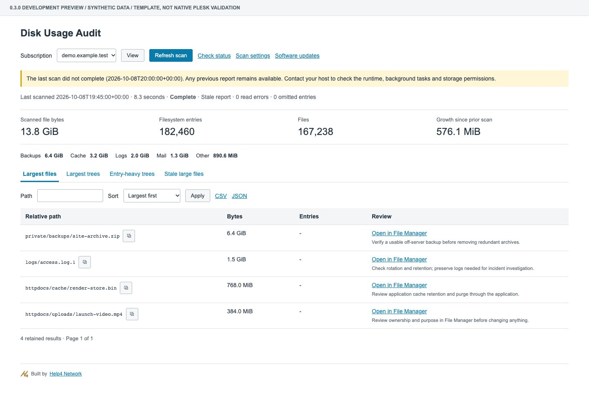
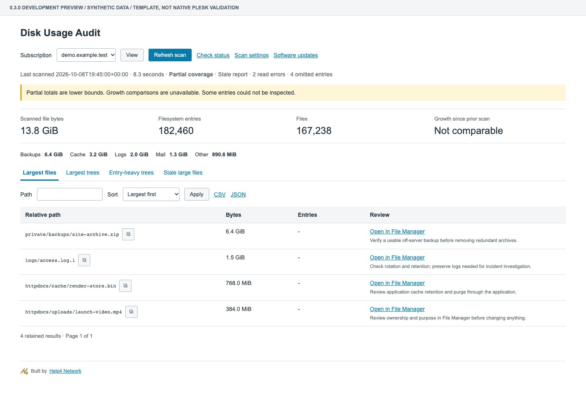
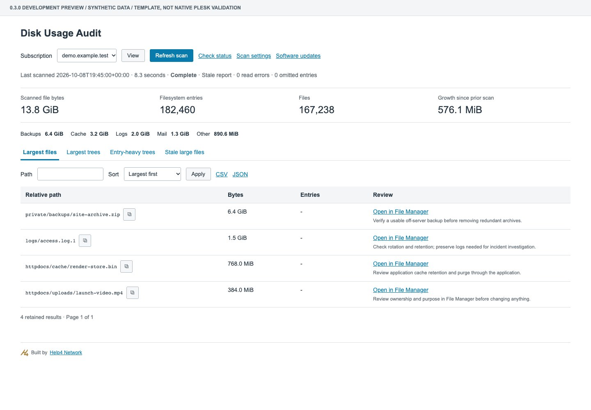
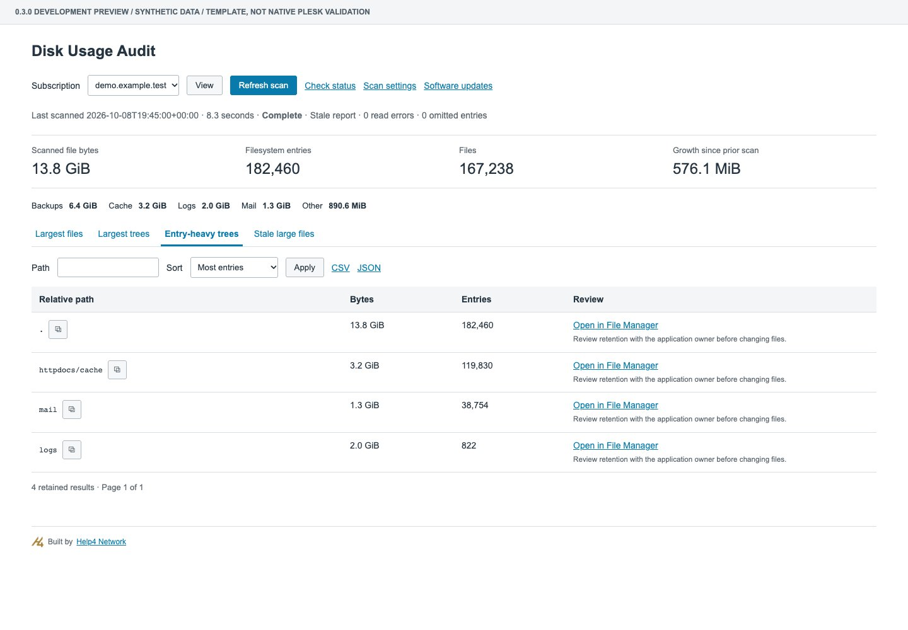
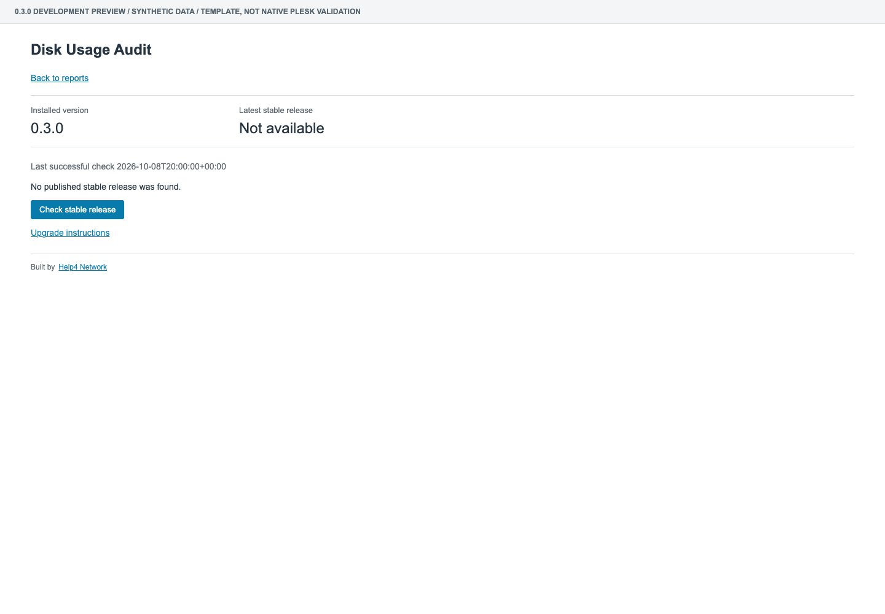

# Operator Tutorial: 0.3.0 Development Preview

This tutorial is for an isolated Plesk lab, not a shared production server. The screenshots render the real extension templates with dummy `demo.example.test` data. They do not prove native Plesk role isolation, background tasks or File Manager behavior. See [release gates](validation.md) before a production rollout.

## 1. Build And Install

Clone this repository, install administrator-owned Python 3.10+ and run the tests. Python has no third-party dependencies. A native Plesk installation and a valid vendor license are separate requirements.

```sh
# Linux lab; run tests/build as an ordinary source owner.
git clone https://github.com/Help4Network/help4-disk-usage-plesk.git
cd help4-disk-usage-plesk
python3 -m unittest discover -s tests -v
php tests/security.php
php tests/policy.php
php tests/releases.php
php tests/controllers.php
php tests/scheduler.php
php tests/runtime.php
php tests/process.php
php tests/lint.php
python3 scripts/package.py
(cd dist && sha256sum -c SHA256SUMS)
# Run the native installer as root, using the actual absolute path.
plesk bin extension --install /absolute/path/dist/help4-disk-usage-0.3.0-1.zip
```

```powershell
# Windows lab; use an elevated terminal only for native installation.
git clone https://github.com/Help4Network/help4-disk-usage-plesk.git
Set-Location help4-disk-usage-plesk
py -3 -m unittest discover -s tests -v
php tests/security.php
php tests/policy.php
php tests/releases.php
php tests/controllers.php
php tests/scheduler.php
php tests/runtime.php
php tests/process.php
php tests/lint.php
py -3 scripts/package.py
Get-Content .\dist\SHA256SUMS
Get-FileHash .\dist\help4-disk-usage-0.3.0-1.zip -Algorithm SHA256
# Compare the digest, then use the actual absolute path.
plesk bin extension.exe --install 'C:\Lab\help4-disk-usage-plesk\dist\help4-disk-usage-0.3.0-1.zip'
```

An extension upload may also be available under **Extensions > My Extensions > Upload Extension**. Use the native extension installer; do not copy extension files into a public subscription home. Verify Windows ACLs independently: hosting users must not read private report/state files or modify Python/the collector. Do not replace those checks with chmod or broad Everyone permissions.

## 2. Set Host Policy

Open **Disk Usage Audit**, then **Scan settings** as an unimpersonated administrator. Set the absolute Python executable path. Keep it administrator-owned and outside customer-writable storage. The default Windows path is a suggestion, not proof that Python exists there.

Defaults are 3 customer refreshes/hour, 300 seconds between requests, 60 seconds runtime and 3,600 seconds freshness TTL. The server admits 60 requests/hour and 16 queued subscriptions; only one scanner runs at once. Actor and subscription limits both apply. Resellers do not bypass them; administrator scans still obey server admission limits.

Subscription overrides use numeric Plesk domain IDs, not hostnames or account names:

```json
{"123":{"hourly":6,"minimum_interval":300,"seconds":90},"456":{"hourly":0}}
```

`hourly:0` disables customer refresh for that subscription. Native Plesk service plans expose an exclusive Disk Usage Audit profile: **Host default**, **Extended**, or **Customer refresh disabled**. With no selected profile, host defaults apply. Extended starts at 6/hour and 90s runtime. Edit default/extended profile limits in Scan settings using:

```json
{"audit_default":{},"audit_extended":{"hourly":6,"seconds":90}}
```

Subscription overrides take precedence over profile values, then host defaults. The disabled profile always blocks customer/reseller refresh, even with an enabling override. Administrators remain subject to global queue/hourly caps. Conflicting or unavailable plan data fails closed. Native plan synchronization and role behavior must still pass the lab matrix; fixture tests do not establish SDK behavior.

The report title is configurable. The small Help4 Network footer remains.

Run the content-free runtime diagnostic after selecting the real Python path:

```sh
plesk bin extension --exec help4-disk-usage doctor.php
```

```powershell
plesk bin extension.exe --exec help4-disk-usage doctor.php
```

A successful runtime check proves Python/API availability only, not private storage ACLs or native roles. The diagnostic has a five-second subprocess deadline and 16 KiB response limit. It fails closed; fix the environment rather than widening safety limits to conceal a failure.

Installation registers one hourly native rotation task; actual scans are **disabled by default**. To opt in, enable **Scheduled stale-report refresh** in Scan settings. Default batch: two missing/stale reports every six hours. Editable range: one to four per tick, one to 24 hours between eligible ticks. Scheduled scans obey the owner, plan, subscription and server limits; disabled plans stay disabled. Disabling scheduled refresh invalidates scheduled reservations. The scheduler does not bypass the single-scanner lock or make the browser auto-refresh.

For a controlled opt-in lab tick, use the native extension CLI with `rotate.php` instead of `doctor.php`. Repeated ticks obey cooldown. The candidate loop is bounded to 10 seconds and 10,000 examined domains, but native inventory lookup duration and fairness across larger fleets remain scale gates; do not interpret this as a certified full-fleet runtime bound. See [platform limits](platform-support.md).



## 3. Request A Report

Select an authorized subscription and click **Refresh scan** once. The request queues a native Plesk background task rather than walking the filesystem inside the page request. The prior report remains available. Click **Check status** when needed; the page does not auto-reload or submit another scan while idle.

If background tasks are unavailable, fix the native task-manager environment. Do not hammer Refresh or run customer-supplied commands. Admission limits and the single-worker lock are intentional shared-server protections.

The queued reservation allows the finite queue to drain at the hard maximum runtime plus a ten-minute allowance. At the default queue size it expires after 46 minutes. **A failed/expired scan** shows a failure notice without erasing the last good report. Ownership, home or relevant plan-policy changes invalidate queued work; an old worker cannot clear a newer reservation. These protections do not make an unavailable native task manager work.



Read the last-scanned timestamp and coverage before acting. **Stale** means the report exceeds the configured TTL, not that an automatic rescan has happened. **Partial coverage** means totals are lower bounds; read-error/omitted-entry counts explain incomplete inspection. Growth is unavailable for partial scans or changed subscription identity.



## 4. Find Actionable Offenders

- **Largest files:** review archives, logs, media and other individual large files.
- **Largest trees:** find directories whose recursive contents account for substantial logical bytes.
- **Entry-heavy trees:** sort by filesystem-entry count to find small-file/cache/mail pressure.
- **Stale large files:** review files at least 10 MiB whose modification time is at least 90 days old. Modification age does not establish that a file is unused.

Search, sort and paging apply to the retained ranking, not every file in the subscription. The default retains 100 rows per view; the hard maximum is 200. Category hints are heuristics, not instructions to delete a directory.





## 5. Review In File Manager

**Open in File Manager** opens a new authenticated panel tab. A file opens its parent directory; a directory opens itself. The server rechecks current subscription access and requires the exact path/kind to belong to the current retained report. A copied or forged foreign URL must be denied.

The extension does not delete, rename, edit or read file contents. Review ownership, application retention and recovery options in the native File Manager/application. Clear caches through the application, retain incident logs, and verify a usable off-server backup before removing archives. Never assume that a stale file or a large mail directory is disposable.

Native File Manager routing and additional-user/impersonated roles remain Linux AND Windows release tests. A rendered link in the synthetic screenshot is not proof that the native destination works.

## 6. Export And Interpret

**CSV** and **JSON** export the current retained report, independently of the table search. CSV cells are neutralized against spreadsheet formula prefixes. JSON omits internal identity/absolute-home details. Downloads still contain potentially private relative paths; share only after review. The public tutorial kit contains dummy paths only.

Bytes are logical file lengths, not allocated blocks, quota usage or billing totals. Sparse files and hard links can differ from physical consumption; hard-link entries count separately. Linux entry counts are not a complete account inode-quota reconciliation. Windows reports entries, not a POSIX inode quota. Data outside the subscription home is excluded. Symlinks, junctions, reparse points and unsupported/network paths are not followed.

## 7. Upgrade Or Remove

As an unimpersonated administrator, open **Software updates** and click **Check stable release**. The check contacts only the fixed public GitHub repository over verified HTTPS. It has a five-minute cooldown, six-second deadline and 64 KiB metadata limit. Customer/reseller/impersonated views cannot request it. Loading the page alone does not make an outbound request.

No stable release found is different from a failed/unavailable check. A failure preserves the previous successful result with a warning; successful results older than 24 hours are labeled stale. The synthetic screenshot shows **no published stable release**; it is not evidence of a 1.0 release or live GitHub connectivity.



Review the fixed-repository release link and changelog. Record the deployed commit/version, finish or cancel pending tasks, pull source, run tests, rebuild, verify the checksum, then use the same native install command with the newly generated versioned ZIP. A Git pull alone does not upgrade Plesk. Policy and reports live outside the source checkout. Older reservations without a policy binding fail closed after this upgrade. There is no unattended download/execute/install pipeline.

For rollback, build and install an identified prior commit in a separate source checkout; review schema compatibility first. Do not restore an old owner's report into a current subscription. No automatic snapshot job is included.

Disable scheduled refresh and finish or cancel queued scans before native uninstall. The pre-uninstall hook refuses a pending or active scan and removes only this extension's rotator. Native task/data cleanup and rollback still require Linux/Windows verification:

```sh
plesk bin extension --uninstall help4-disk-usage
```

```powershell
plesk bin extension.exe --uninstall help4-disk-usage
```

Verify task/data cleanup on both OSes before stable release. WHMCS integration is [planned separately](whmcs.md); this preview does not supply a working Plesk WHMCS adapter.

Built by [Help4 Network](https://help4network.com). MIT licensed; not endorsed or certified by Plesk.
